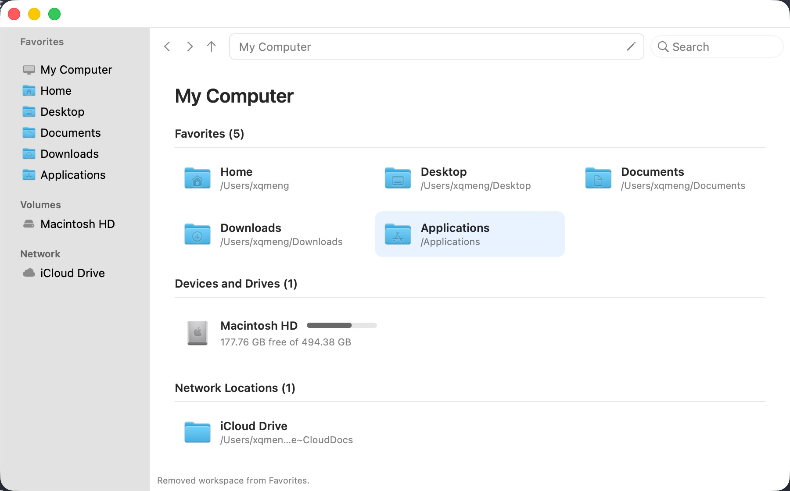
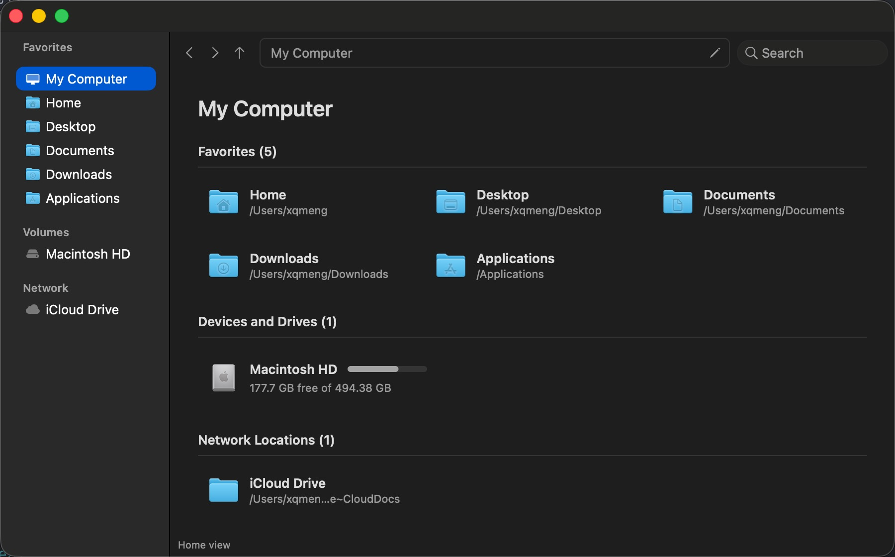

# Explorer.app

A native macOS file manager that uses Windows Explorer-style navigation—tabs, a sidebar of folder shortcuts, a path bar, and a details list—while following macOS conventions such as Quick Look, Trash, and Command shortcuts.

The current builds are **preview releases**: unsigned, Apple Silicon only, and still changing. See [Releases](https://github.com/xq-meng/explorer.app/releases) for the latest version.

Before using a preview build for important files, review the current [known issues](docs/known-issues.md). Keep a separate backup of data used to test destructive operations.

<p align="center">
  
  
</p>

## Features

- Multiple windows and tabs, each with its own history
- Details and icon views, with sortable columns
- Sidebar for Favorites, mounted volumes, and Network (including iCloud Drive)
- Clickable breadcrumbs, or type a path with Command-L
- Spotlight search in the current folder tree
- Quick Look with Space, plus an optional preview pane
- Copy, cut, paste, rename, duplicate, Trash, and Shift-Delete
- Conflict handling: replace, keep both, skip, stop, or apply to all
- Undo and redo for completed file operations
- Coordinated file mutations and startup recovery for interrupted replacements
- Cloud-only iCloud items show a cloud badge in the Name column

## Requirements

- macOS 14 or later
- Apple Silicon for the prebuilt zip and Homebrew cask
- Intel Macs can [build from source](#build-from-source)

## Install

### Homebrew

Add the tap, then install the cask:

```bash
brew tap xq-meng/tap
brew install --cask explorer-app
xattr -dr com.apple.quarantine /Applications/Explorer.app
```

Or in one step, which taps [`xq-meng/homebrew-tap`](https://github.com/xq-meng/homebrew-tap) automatically:

```bash
brew install --cask xq-meng/tap/explorer-app
xattr -dr com.apple.quarantine /Applications/Explorer.app
```

Either way, `Explorer.app` is installed into `/Applications`.

Preview builds are ad-hoc signed and not notarized. Gatekeeper therefore quarantines the download. The `xattr` command removes that flag so you can open the app. If macOS still says the app is damaged, run `xattr` again, then open Explorer from Finder with **Right-click → Open**.

Update:

```bash
brew upgrade --cask explorer-app
xattr -dr com.apple.quarantine /Applications/Explorer.app
```

Uninstall:

```bash
brew uninstall --cask explorer-app
```

### GitHub Releases

1. Download `Explorer-<version>-arm64.zip` from [Releases](https://github.com/xq-meng/explorer.app/releases).
2. Unzip it and drag `Explorer.app` into `/Applications`.
3. Remove quarantine, then open the app:

```bash
xattr -dr com.apple.quarantine /Applications/Explorer.app
open /Applications/Explorer.app
```

## Build from source

You need a recent Xcode with Swift 6 support.

```bash
git clone https://github.com/xq-meng/explorer.app.git
cd explorer.app
./scripts/package-app.sh
open .build/artifacts/Explorer.app
```

The packaged bundle is ad-hoc signed and written to `.build/artifacts/Explorer.app`. Copy it to `/Applications` if you want it in Launchpad.

To run without packaging a bundle:

```bash
swift run ExplorerApp
```

Contributor setup, tests, and local tooling are in [docs/development.md](docs/development.md).

## Keyboard shortcuts

| Shortcut | Action |
| --- | --- |
| Command-L | Edit the current path |
| Command-T / Command-W | New tab / close tab |
| Command-N / Command-Shift-W | New window / close window |
| Command-1 / Command-2 | Details view / icon view |
| Command-Shift-P | Toggle the preview pane |
| Command-Shift-. | Show or hide hidden files |
| Command-Control-D | Add the current folder to Favorites |
| Command-Z / Command-Shift-Z | Undo / redo a file operation |
| Space | Quick Look |
| Backspace | Back |
| Delete (Fn-Delete on compact Mac keyboards) | Move to Trash |
| Shift-Delete (Shift-Fn-Delete on compact Mac keyboards) | Delete immediately |

## Documentation

- [Development](docs/development.md) — build, test, and package locally
- [Releasing](docs/releasing.md) — preview tags, GitHub Releases, and the Homebrew tap
- [Architecture](docs/architecture.md) — module layout and safety rules
- [Roadmap](docs/roadmap.md) — milestones and planned work
- [Known issues](docs/known-issues.md) — current preview limitations and safety notes
- [Regression checklist](docs/regression-checklist.md) — automated and manual release gates
